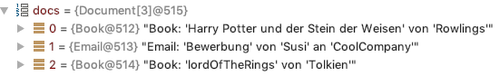

# Übung

## Aufgabe 1: Einlesen einer Datei

Gegeben ist eine Klasse `StringCompress` mit den drei Methoden:
- public String[] readFromFile(String fileName)
- public void print(String[] lines)
- public int getNoOfLines(String fileName)

und der main-Methode.

Implementieren Sie die drei Methoden. Mit der Methode `readFromFile` werden "komprimierte" Zeichenketten eingelesen. Die Methode gibt ein String-Array zurück (wie unten dargestellt).


Inhalt der Datei `sample.txt`

```
A5
B3
C27
D15
```

Inhalt des String-Arrays:

| index | String |
| --- | --- |
| 0 | AAAAA
| 1 | BBB
| 2 | CCCCCCCCCCCCCCCCCCCCCCCCCCC
| 3 | DDDDDDDDDDDDDDD

Die Methode `getNoOfLines` zählt die Zeilen der Textdatei (Tipp: braucht man für die `readFromFile`-Methode).

Die Methode `print` gibt schließlich den Inhalt des String-Arrays zeilenweise am Bildschirm aus. 

```
AAAAA
BBB
CCCCCCCCCCCCCCCCCCCCCCCCCCC
DDDDDDDDDDDDDDD
```

## Aufgabe 2: Erstellen einer Klassenhierarchie
Führen Sie folgendes durch:

1. Erstellen Sie folgende Klassenhierarchie
   

1. Erstellen Sie 2 Bücher und ein email
   
   ```
   Buch: "Rowlings", "Harry Potter und der Stein der Weisen"
   Email: "Susi", "Bewerbung", "CoolCompany"
   Buch: "Tolkien", "lordOfTheRings"
   ```
   
2. Erstellen Sie ein Document-Array und speichern Sie obige Dokumente in diesem Array.

   

3. Geben Sir die Inhalte dieser Documente wie folgt aus.
   Nutzen Sie dabei die Mechanismen der Vererbung.
   Erstellen Sie außerdem geeignete toString-Methoden

4. Zählen Sie die Bücher und emails im Array und geben Sie die jeweilige Anzahl aus.


```
Book: 'Harry Potter und der Stein der Weisen' von 'Rowlings'
Email: 'Bewerbung' von 'Susi' an 'CoolCompany'
Book: 'lordOfTheRings' von 'Tolkien'

Anzahl Books: 2
Anzahl Email: 1
```

```
____   ____.__       .__    ___________        _____      .__         ._.
\   \ /   /|__| ____ |  |   \_   _____/_______/ ____\____ |  |    ____| |
 \   Y   / |  |/ __ \|  |    |    __)_\_  __ \   __\/  _ \|  |   / ___\ |
  \     /  |  \  ___/|  |__  |        \|  | \/|  | (  <_> )  |__/ /_/  >|
   \___/   |__|\___  >____/ /_______  /|__|   |__|  \____/|____/\___  /__
                   \/               \/                         /_____/ \/
```